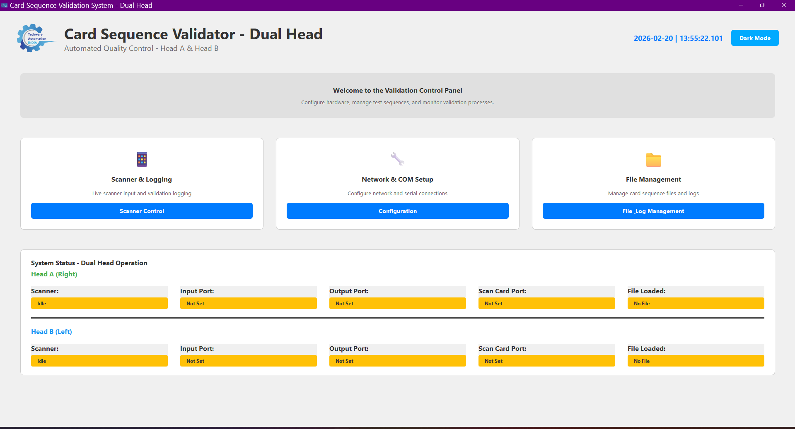
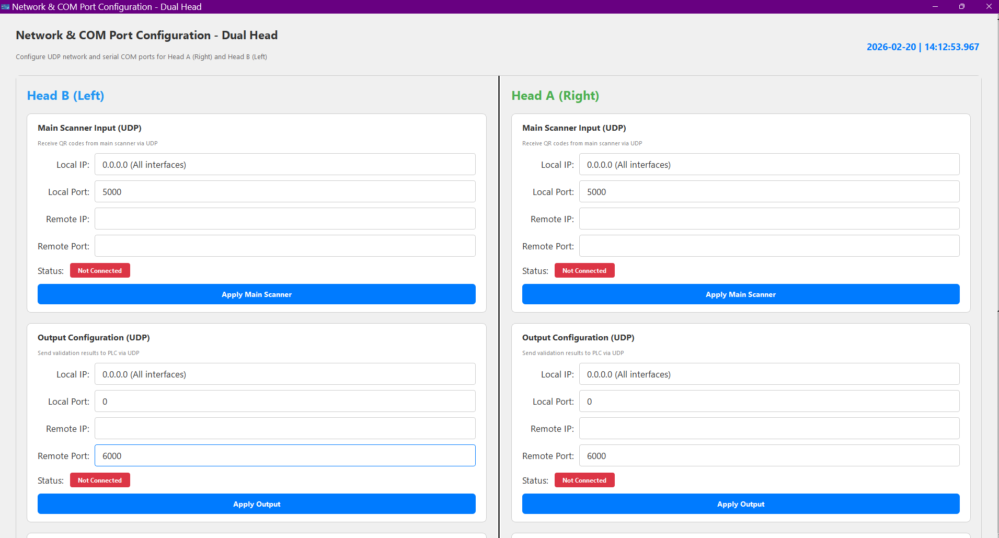
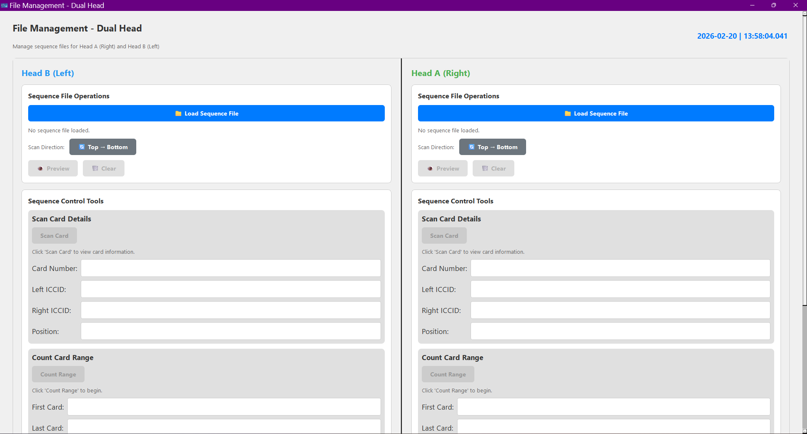
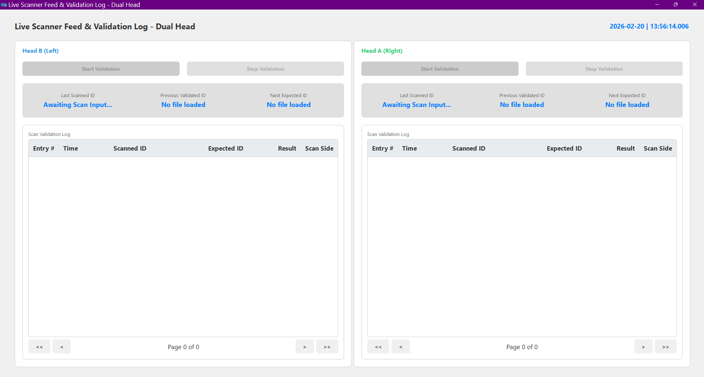

# Card Sequence Validator - Dual Head System

> **⚠️ PRIVATE REPOSITORY** - This is a proprietary industrial card validation system. Unauthorized distribution is prohibited.
> 
> **Project Owner**: Ayush Raj Chauhan
> **Contact**: ayushraj790673@gmail.com

A professional desktop application for high-throughput validation of card sequences with embedded QR codes (ICCIDs). Features dual-head architecture for simultaneous independent validation operations in industrial environments.

## 📸 Screenshots & Demo

<!-- Add your screenshots here -->

*Main application dashboard with dual-head status monitoring*


*UDP and COM port configuration interface*


*Dual-head job management with sequence preview*


*Real-time validation logging and monitoring*

### 🎥 Demo Video
[](docs/demo/card-validator-demo.mp4)
*Click to watch the full application demonstration*

## 🚀 Key Features

### **Dual-Head Architecture**
- **Simultaneous Operation**: Two independent validation heads (Head A & Head B) operating concurrently
- **Independent Configuration**: Separate network settings, files, and logs for each head
- **Color-Coded Interface**: Head A (Green) and Head B (Blue) for easy identification
- **Unified Management**: Centralized control with individual head monitoring

### **Industrial-Grade Reliability**
- **Auto-Save Protection**: Automatic cache saving every 60 seconds or 100 scans
- **Atomic File Operations**: Power-loss protection with atomic cache writes
- **Multi-NIC Support**: Proper handling of systems with multiple network interfaces
- **Thread-Safe Operations**: Reentrant locking for concurrent access protection

### **Advanced Card Validation**
- **Multiple Card Types**: Single, Half, and Quarter card formats
- **Intelligent Positioning**: Automatic card position detection based on file structure
- **Checksum Handling**: Configurable digit stripping (1-6 digits) from scanned codes
- **Mismatch Management**: User approval dialogs for sequence discrepancies
- **Scan Direction Support**: Top-to-bottom or bottom-to-top scanning modes

### **Network-First Communication**
- **UDP Primary**: Modern network-based scanner communication
- **Legacy COM Support**: Serial port compatibility for older systems
- **Real-Time Monitoring**: Live connection status with color-coded indicators
- **Device Discovery**: Automatic ping functionality for network diagnostics
- **PLC Integration**: Direct output signals to industrial control systems

### **Professional User Interface**
- **PyQt6 Framework**: Modern, responsive desktop interface
- **Theme Support**: Dark/Light themes with Windows system integration
- **Real-Time Logging**: Live validation results with pagination
- **Animated Startup**: Professional loading animations and transitions
- **Scalable Design**: Responsive layout for different screen sizes

### **Security & Licensing**
- **RSA License Validation**: Machine-locked licensing with hardware fingerprinting
- **Password Protection**: Secure access to configuration windows
- **Environment Variables**: Secure credential management
- **Audit Trail**: Comprehensive logging of all validation activities

## 📋 System Requirements

- **Operating System**: Windows 10/11 (Primary), Windows Server 2019+
- **Python**: 3.8+ (for development)
- **Memory**: 4GB RAM minimum, 8GB recommended
- **Network**: Ethernet adapter for UDP communication
- **Storage**: 100MB free space for application and logs
- **Display**: 1920x1080 minimum resolution recommended

## 🛠️ Installation & Setup

### **Production Deployment (Recommended)**
1. Download the latest release executable from the releases section
2. Run the installer as Administrator
3. Configure license file (contact support for licensing)
4. Launch the application from Start Menu or Desktop shortcut

### **Development Setup**
1. **Clone the repository** (requires access permissions):
   ```bash
   git clone https://github.com/Ayushraj1329/Dual-Head-Card-Sequence-Validator.git
   cd Dual-Head-Card-Sequence-Validator
   ```

2. **Create virtual environment**:
   ```bash
   python -m venv .venv
   .venv\Scripts\activate  # Windows
   # source .venv/bin/activate  # Linux/Mac
   ```

3. **Install dependencies**:
   ```bash
   pip install -r requirements.txt
   ```

4. **Configure environment variables**:
   ```bash
   copy .env.example .env
   # Edit .env file with your configuration
   ```

5. **Run the application**:
   ```bash
   python main.py
   ```

## 🎯 Quick Start Guide

### **1. Initial Setup**
- Launch the application and select card type (Single/Half/Quarter)
- Configure network settings for your scanners and PLCs
- Load your card sequence file (.cpd format)

### **2. Network Configuration**
- **Main Scanner**: Configure UDP input for QR code reception
- **Output**: Set up UDP output to PLC for validation signals
- **On-Demand Scanner**: Optional secondary scanner configuration

### **3. File Management**
- Load CPD files with card sequence data
- Preview sequences with scan direction indicators
- Configure start cards and validation parameters

### **4. Live Validation**
- Start scanning operations for both heads
- Monitor real-time validation results
- Handle mismatches with approval dialogs
- View comprehensive logging with pagination

## 📁 Project Structure

```
card-sequence-validator/
├── main.py                     # Application entry point
├── requirements.txt            # Python dependencies
├── constants.py               # Application constants
├── output_formats.json        # Validation output formats
├── .env.example              # Environment variables template
├── SECURITY.md               # Security policy
├── assets/                   # Application resources
│   ├── favicon.ico
│   ├── gear_loader.gif
│   ├── Icon.png
│   └── logo.png
├── src/                      # Source code
│   ├── app_state.py         # Application state management
│   ├── dual_head_manager.py # Dual-head coordination
│   ├── card_types.py        # Card type definitions
│   ├── logic/               # Business logic
│   │   └── file_parser.py   # File parsing utilities
│   ├── services/            # Core services
│   │   ├── udp_reader.py    # UDP communication
│   │   ├── udp_writer.py    # UDP output
│   │   ├── com_writer.py    # Serial communication
│   │   ├── utilities.py     # Helper functions
│   │   └── licensing.py     # License validation
│   └── ui/                  # User interface
│       ├── main_application.py      # Main window
│       ├── network_setup_dual.py    # Network configuration
│       ├── file_management_dual.py  # File management
│       ├── scanner_logging_dual.py  # Live logging
│       ├── card_type_selector.py    # Card type selection
│       ├── styles.py               # UI themes
│       └── widgets.py              # Custom widgets
├── tests/                   # Test files
├── docs/                    # Documentation
│   ├── screenshots/         # Application screenshots
│   └── demo/               # Demo videos
└── build_exe.py           # Build configuration
```

## 🔧 Configuration

### **Environment Variables**
Create a `.env` file based on `.env.example`:
```bash
# Master password for application access
MASTER_PASSWORD=[YOUR_SECURE_PASSWORD]

# Optional: Custom license file path
LICENSE_FILE_PATH=[PATH_TO_YOUR_LICENSE_FILE]
```

### **Card Types**
- **Single Card**: One ICCID per card (ISO standard cards)
- **Half Card**: Two ICCIDs per card (Left/Right positions)
- **Quarter Card**: Four ICCIDs per card (BL/TL/TR/BR positions)

### **Output Formats**
Validation results are sent as integer codes (configurable in `output_formats.json`):
- **OK**: Validation passed
- **NOT OK**: Validation failed
- **OK (JUMPED)**: Card skipped but approved
- **LAST OK**: Final card in sequence

## 🔒 Security Considerations

- **License Protection**: RSA-signed licenses tied to hardware fingerprints
- **Network Security**: Configure firewalls for UDP communication ports
- **Access Control**: Password-protected configuration windows
- **Data Privacy**: Local data storage with no external transmission
- **Audit Logging**: Comprehensive validation history for compliance

## 🐛 Troubleshooting

### **Common Issues**
1. **License Validation Failed**: Ensure license.dat file is present and valid for this machine
2. **Network Connection Issues**: Check firewall settings and network adapter configuration
3. **File Parsing Errors**: Verify CPD file format and encoding (UTF-8 required)
4. **Scanner Not Responding**: Confirm UDP settings and network connectivity

### **Debug Mode**
Enable debug logging by setting environment variable:
```bash
set DEBUG_MODE=1
python main.py
```

## 📞 Support & Contact

- **Technical Support**: ayushraj790673@gmail.com
- **Project Owner**: Ayush Raj Chauhan - ayushraj790673@gmail.com
- **License Issues**: ayushraj790673@gmail.com
- **Documentation**: See `docs/` folder for detailed guides


**© 2026 ARC. All rights reserved.**
